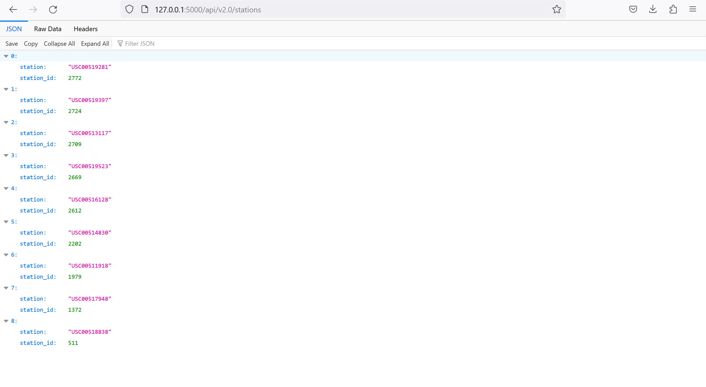
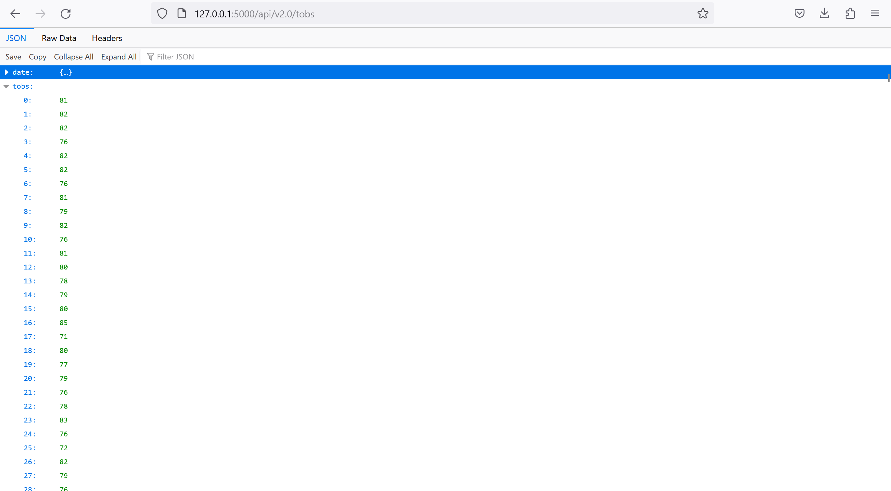

# HawaiiClimateDataAPI

For this project, I used Python to perform analysis on a climate database before mapping said database to a custom built REST-API. I used Python and SQLAlchemy to do climate analysis and exploration on a hawaii.sqlite database, all analysis was completed using SQLAlchemy ORM queries, Pandas, and Matplotlib. The REST-API was developed using vanilla Flask.

*This project was for an assignment at Washington University's Data Analytics Boot Camp (2019).*

## Technologies used
- Python
- HTML
- CSS
- Jupyter Notebook
- Pandas
- Flask
- Black
- VS Code

## Sections
- [Analysis](#Analysis)
- [API](#Climate-API)

## Analysis
### Precipitation summary statistics (within 12 month range)

### Last 12 months of temperature observation data (tobs)

- - -

# Climate API

### Home 

### /api/v2.0/precipitation

### /api/v2.0/stations
Returns a JSON list of stations from the dataset.

### /api/v2.0/tobs
Returns a JSON list of Temperature Observations (tobs) for the most recent 12 months of dataset.

### /api/v2.0/start-date
Returns a JSON list of the minimum temperature, the average temperature, and the max temperature for a given start or start-end range.

### /api/v2.0/start-date/end-date

