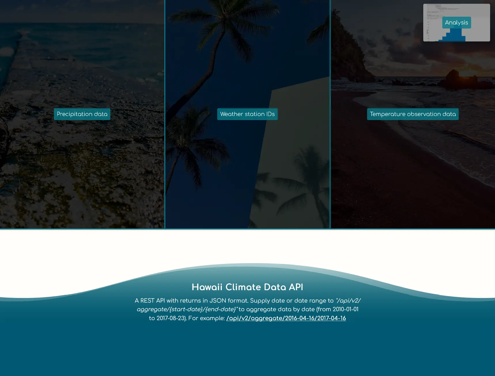

# Hawaii Climate Data API

For this project, I used Python to perform analysis on a climate database before mapping said database to a custom built REST-API. The database features Hawaii Climate data between `2010-01-01` and `2017-08-23`. I used Python and SQLAlchemy to do climate analysis and exploration on a hawaii.sqlite database, all analysis was completed using SQLAlchemy ORM queries, Pandas, Matplotlib, and Jupyter Notebook. The REST-API was developed using Python (Flask).



_This project was for an assignment at Washington University's Data Analytics Boot Camp (2019)._

## Table of contents

- [Technologies Used](#technologies-used)
- [How to run locally](#how-to-run-locally)
  - [Run on Windows](#run-on-windows)
  - [Run on Docker](#run-on-docker)
- [Screenshots](#screenshots)
  - [API](#climate-api)
    - [Desktop](#desktop)
    - [Mobile](#mobile)
  - [Analysis](#analysis)

## Technologies used

- Python
- HTML
- CSS
- Jupyter Notebook
- Matplotlib
- Pandas
- Flask
- Black
- gunicorn
- VS Code
- Docker

## How to run locally

- If you are trying to run this application directly on a Windows OS, you will need to install `Python 3.11`. You will also likely have to install Visual Studio and Microsoft C++ Build Tools.
- Alternatively, the recommended way is to install Docker so you can run the application through Docker.

### Run on Windows

Assumes you are using a modern Windows client OS such as Windows 11 or Windows 10 and that Python 3.11 is installed.

**It is assumed the user is at the root of this project and is using a UNIX style command line environment when referencing the CLI commands below.**

Open terminal at root of this project then move into application/ directory:

```bash
cd application/
```

Create venv folder in application folder using Python 3.11:

```bash
python3.11 -m venv venv
```

Activate venv:

```bash
source venv/Scripts/activate
```

Install python packages to venv:

```bash
pip install -r requirements.txt
```

Start application:

```bash
python application.py
```

### Run on Docker

Firstly, confirm that Docker is installed and running. Next confirm that no other application is using port `5000` as port `5000` is needed for the Flask server. If you need to run Flask on an alternative port, you can modify the last line in the `application/application.py` file and the ports in the `docker-compose.yml` file.

**It is assumed the user is at the root of this project and is using a UNIX style command line environment when referencing the CLI commands below.**

Build Docker image and start Docker container:

```bash
docker compose up --build
```

Visit: <http://localhost:5000> to use the application.

## Screenshots

## Climate API

### Desktop

#### Landing page


#### Landing page, hover over Precipitation button


#### Precipitation results


#### Landing page, hover over Weather Station IDs button


#### Weather Station IDs results


#### Landing page, hover over TOBs button


#### TOBs results


#### Landing page, hover over Analysis button


#### Analysis page 1


#### Analysis page 2


#### Analysis page 3


#### Analysis page 4


#### Analysis page 5


#### Analysis page 6


#### Analysis page 7


#### Aggregate results for specified date range


### Mobile

#### Landing page


#### Top of analysis page


---

### Analysis

#### Precipitation summary statistics (within 12 month range)


#### Last 12 months of temperature observation data (tobs)


