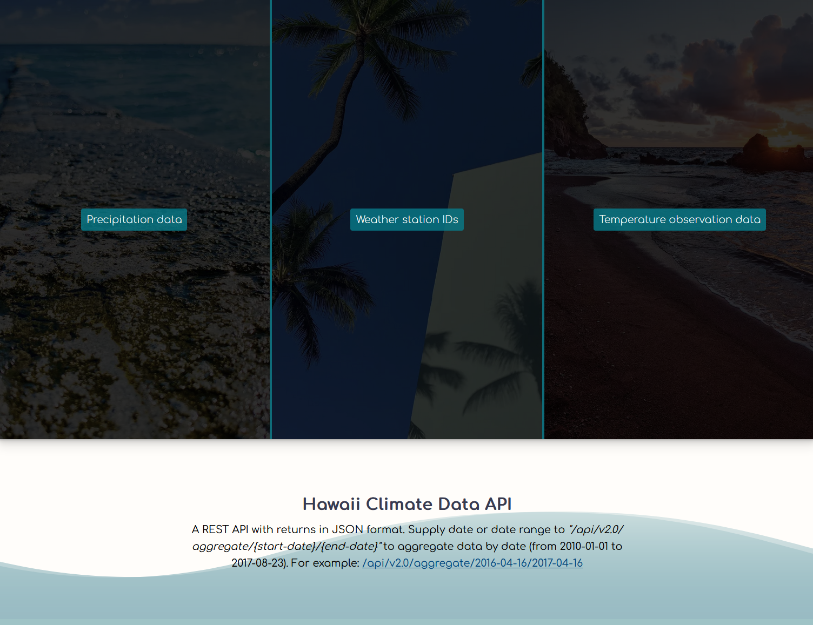

# HawaiiClimateDataAPI

For this project, I used Python to perform analysis on a climate database before mapping said database to a custom built REST-API. The database features Hawaii Climate data between `2010-01-01` and `2017-08-23` I used Python and SQLAlchemy to do climate analysis and exploration on a hawaii.sqlite database, all analysis was completed using SQLAlchemy ORM queries, Pandas, and Matplotlib. The REST-API was developed using Python (Flask).



_This project was for an assignment at Washington University's Data Analytics Boot Camp (2019)._

# Table of contents

- [Technologies Used](#technologies-used)
- [How to run locally](#how-to-run-locally)
  - [Run on Windows](#run-on-windows)
  - [Run on Docker](#run-on-docker)
- [Screenshots](#screenshots)
  - [API](#Climate-API)
  - [Analysis](#Analysis)

## Technologies used

- Python
- HTML
- CSS
- Jupyter Notebook
- Matplotlib
- Pandas
- Flask
- Black
- VS Code
- Docker

# How to run locally

- If you are trying to run this application directly on a Windows OS, you will need to install `Python 3.11`.
- Otherwise, you will need to install Docker so you can run the application through Docker.

## Run on Windows

Assumes you are using a modern Windows client OS such as Windows 11 or Windows 10 and that Python 3.11 is installed.

**It is assumed the user is at the root of this project and is using a UNIX style command line environment when referencing the CLI commands below.**

Open terminal at root of this project then move into application/ directory:

```
cd application/
```

Create venv folder in application folder using Python 3.11:

```
python3.11 -m venv venv
```

Activate venv:

```
source venv/Scripts/activate
```

Install python packages to venv:

```
pip install -r requirements.txt
```

Start application:

```
python application.py
```

## Run on Docker

Firstly, confirm that Docker is installed and running. Next confirm that no other application is using port `5000` as port `5000` is needed for the Flask server. If you need to run Flask on an alternative port, you can modify the last line in the `application/application.py` file.

**It is assumed the user is at the root of this project and is using a UNIX style command line environment when referencing the CLI commands below.**

Open terminal at root of this project then move into docker/ directory:

```
cd docker/
```

Build Docker image and start Docker container:

```
docker compose up --build
```

Visit: http://localhost:5000 to use the application.

## Screenshots

# Climate API

### Home (Desktop)


### /api/v2.0/precipitation

Returns precipitation data for the most recent 12 months of dataset.


### /api/v2.0/stations

Return station data.


### /api/v2.0/tobs

Returns temperature observation data (tobs) from 12 most recent months of dataset.


### /api/v2.0/aggregate/start-date/end-date

Returns minimum temperature, average temperature, and the max temperature for a given start or start-end range.


---

## Analysis

### Precipitation summary statistics (within 12 month range)


### Last 12 months of temperature observation data (tobs)


